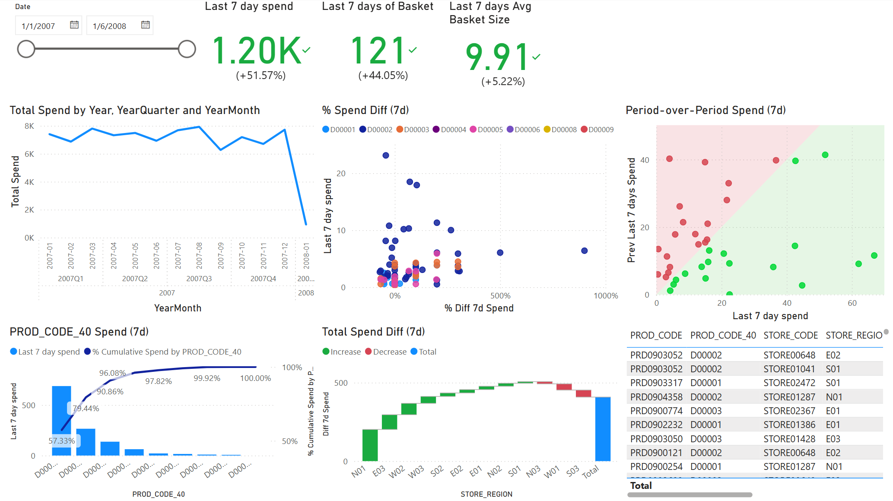
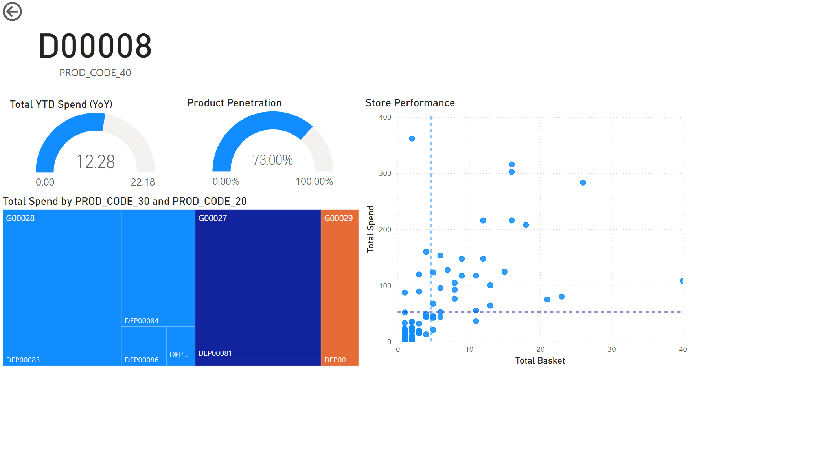
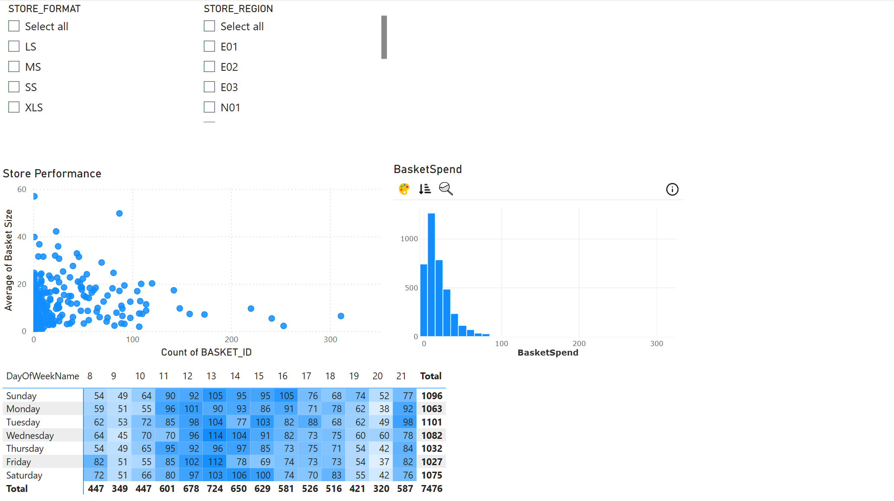
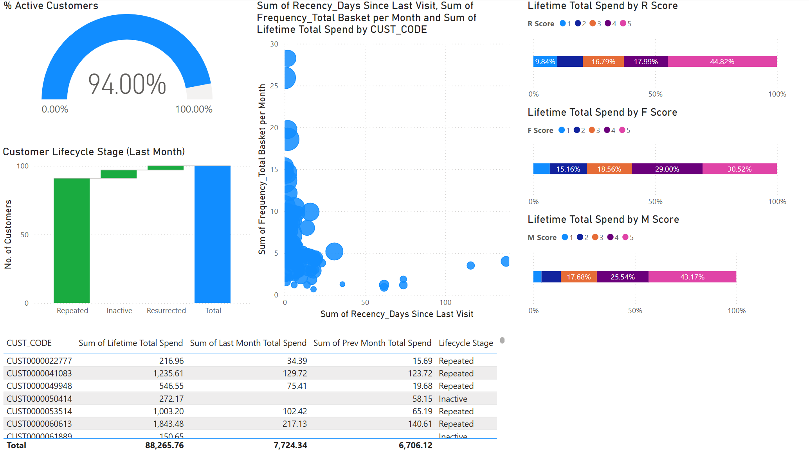

# 🛍️ Power BI Retail Dashboard

This repository presents a data-driven solution to common challenges in retail performance management. The dashboard is built in **Power BI** and provides actionable insights across Sales, Products, Stores, and Customer segments.

---

## 🧩 Business Problem

Retail businesses often face these challenges:
- Inability to track short-term sales momentum or detect sudden drops.
- Lack of visibility into product-level performance and over/underperforming items.
- Fragmented store performance insights by region, format, and traffic patterns.
- No systematic way to monitor customer retention, frequency, and loyalty.

Without an integrated dashboard, decision-makers cannot take timely, data-driven actions.

---

## 🔍 Reason for Action

To enable faster and smarter decision-making, we developed an interactive Power BI dashboard that:
- Monitors **recent sales and basket trends**
- Highlights **product and store performance differentials**
- Tracks **customer lifecycle and engagement**
- Supports **filtering by time, product codes, regions, and store formats**

---

## 📊 Dashboard Storytelling

### 🔹 1. Sales Overview

- Displays total spend trends by year, quarter, and month.
- Shows 7-day spend with % changes and KPIs (Basket volume, Avg basket size).
- Visualizes period-over-period comparison and outlier detection.



---

### 🔹 2. Product Performance

- Tracks YoY product spend and penetration.
- Highlights top-selling and underperforming products.
- Evaluates store-wise performance by product sales and basket volume.



---

### 🔹 3. Store Analytics

- Filters performance by **store format** and **region**.
- Compares store output using basket size vs basket count.
- Includes day-of-week heatmap and histogram of basket spend distribution.



---

### 🔹 4. Customer Insights

- Segments customers by **RFM score** (Recency, Frequency, Monetary).
- Identifies lifecycle stages: Repeated, Inactive, Resurrected.
- Tracks % of active customers and monthly retention patterns.



---

## 🗃️ Data Sources

All data is located in the `dataset/` folder and used as the base for Power BI:

| File Name         | Description |
|------------------|-------------|
| `transactions.csv` | Transactional data with basket ID, date, spend |
| `products.csv`     | Product master file including category hierarchy |
| `stores.csv`       | Store details with region and format attributes |

---

## 📁 Repository Structure
```
PowerBI-Retail-Dashboard/
├── dataset/
│   ├── transactions.csv
│   ├── products.csv
│   └── stores.csv
├── 01_Sale_Dashboard.png
├── 02_Product_Dashboard.png
├── 03_Store_Dashboard.png
├── 04_Customer_Dashboard.png
├── Retail_Dashboard.pbix
└── README.md
```

---
